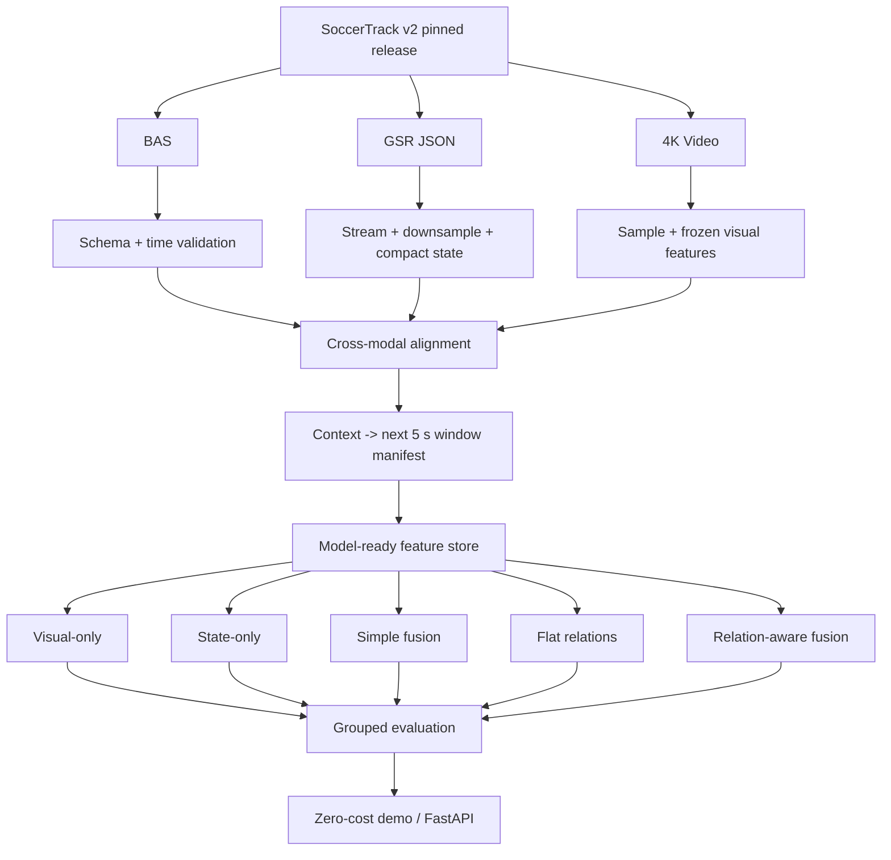

# Historical README Before Public-Release Reconstruction

This file preserves the README text that existed in the historical snapshot used as the basis for this public release. It is retained for provenance. The repository-root README was rewritten only for clearer Git onboarding.

---

---
type: moc
status: active
version: v5
updated: 2026-08-14
tags: [thesis, football, baa, git-ready, moc]
---
# Evaluating Game-State Fusion for Short-Horizon Ball Action Anticipation in Football

## 1. Project Overview
This research project investigates whether explicit synchronized player-level game state can improve short-horizon football Ball Action Anticipation. The model observes football context before an action occurs and predicts the classes and temporal locations of ball actions in the following 5-second unobserved interval.

The repository also preserves the complete research journey: rejected directions, literature threats, AI-assisted audits, direct dataset inspection, corrections, benchmark decisions, compute constraints, and the final proposal architecture.

## 2. Features
1. Visual-only, game-state-only, simple-fusion, flat-relations, and relation-aware controlled baselines.
2. Derived SoccerTrack v2 BAA protocol with strict match-level leakage prevention.
3. Version-pinned dataset and cross-modal BAS/GSR/video alignment gates.
4. Streaming preprocessing for multi-gigabyte GSR JSON files.
5. One-time frozen visual feature extraction from panoramic 4K video.
6. Compact continuous feature stores instead of duplicated overlapping clips.
7. Five-fold grouped evaluation where final usable match count permits it.
8. Mini 10-minute feasibility pilot before spending the full paid compute budget.
9. Zero-recurring-cost inference/demo architecture.
10. Graph-native Obsidian research history with PR-001 through PR-005 and correction provenance.

## 3. Tech Stack
1. **Python + PyTorch**: training, evaluation, and feature processing.
2. **FFmpeg**: efficient video sampling and temporary media processing.
3. **SoccerTrack v2**: panoramic video, Game State Reconstruction, and Ball Action Spotting annotations.
4. **Parquet + NumPy/NPZ**: compact event, state, and visual feature stores.
5. **Streaming JSON tooling / official loaders**: safe GSR processing without whole-file loading.
6. **Google Colab/Kaggle**: GPU/TPU access under a constrained compute budget.
7. **FastAPI**: final lightweight inference service.
8. **Obsidian + Git**: research knowledge graph, backlinks, diffs, tags, and historical snapshots.
9. **LaTeX**: academic proposal and later thesis/paper writing.

## 4. Architecture


System details: [[20_system_architecture/END_TO_END_DATA_SYSTEM_ARCHITECTURE]].  
Feasibility gate: [[20_system_architecture/FEASIBILITY_PILOT_PLAN]].  
Current state: [[00_project_governance/CURRENT_STATE]].

## 5. Project Structure
```text
Thesis_Research_Project/
├── 00_context/              # researcher/team context
├── 00_project_governance/   # current state and project rules
├── 01_goals_constraints/    # compute, deployment, data, timeline constraints
├── 02_journey/              # full domain/topic exploration history
├── 03_datasets/             # SoccerTrack/SoccerNet evidence and direct audits
├── 04_literature/           # verified sources and related-work matrix
├── 05_direction/            # task and domain concepts
├── 06_research_gaps/        # current and historical gap nodes
├── 07_topic_selection/      # titles, candidates, downgrades, rejections
├── 08_experiments/          # benchmark, baselines, model/ablation matrix
├── 09_implementation/       # compute and implementation status
├── 10_writing/              # thesis and paper status
├── 11_publication/          # publication planning
├── 12_defense/              # defense preparation
├── 13_execution/            # one-month execution plan
├── 14_decisions/            # atomic decisions and decision log
├── 15_ai_configuration/     # AI roles and PR-001 ... PR-005
├── 16_session_history/      # chronological research journey
├── 17_migration/            # original-vault provenance
├── 18_version_history/      # v1 ... v5 lineage
├── 19_verification/         # evidence locks and correction audits
├── 20_system_architecture/  # large-data, compute, alignment, pilot, deployment
├── 21_proposal/             # proposal artifact index
├── KNOWLEDGE_GRAPH.md       # graph-level map of the research
└── README.md
```

## Version and Evidence Boundary
This is **v5, 2026-08-14**. Exact final benchmark counts and folds are intentionally not claimed until the pinned SoccerTrack v2 release passes the alignment and correction gate. See [[18_version_history/VERSION_HISTORY]] and [[19_verification/FULL_EVIDENCE_REVERIFICATION_2026-08-14]].


Graph integrity record: [[GRAPH_AUDIT]].


## Additional Navigation
- [[KNOWLEDGE_GRAPH]]
- [[10_writing/THESIS_AND_PAPER_STATUS]]
- [[11_publication/PUBLICATION_STATUS]]
- [[12_defense/DEFENSE_STATUS]]
- [[08_experiments/EXPERIMENT_STATUS]]
- [[17_migration/MIGRATION_MANIFEST]]
- [[00_project_governance/PROJECT_RULES]]


Proposal draft: [[21_proposal/PROPOSAL_DRAFT]].
