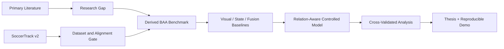

# Historical README Before Public-Release Reconstruction

This file preserves the README text that existed in the historical snapshot used as the basis for this public release. It is retained for provenance. The repository-root README was rewritten only for clearer Git onboarding.

---

---
type: moc
status: active
version: v4
updated: 2026-08-14
tags: [thesis, research-project, git-ready, moc]
---
# Thesis Research Project

## 1. Project Overview
This repository preserves the complete research journey for an undergraduate CSE thesis on football video understanding. The active direction evaluates whether explicit player-level game state can improve short-horizon Ball Action Anticipation, where future ball actions must be predicted before the target action becomes visible.

The vault preserves both successful and rejected directions, evidence corrections, AI research runs, dataset audits, benchmark decisions, and implementation gates so the final thesis can be reconstructed from its reasoning history.

## 2. Features
1. Full topic-evolution history from PCBAS and football retrieval/forecasting candidates to the current BAA direction.
2. Primary-source related-work graph with explicit novelty threats.
3. PR-001 through PR-005 AI research-run provenance and corrections.
4. Direct SoccerTrack v2 BAS audit and release-quality risk tracking.
5. Evidence-locked benchmark framework and leakage rules.
6. Controlled B0-B5 experiment ladder separating modality value from relation-model value.
7. Decision and rejection logs that preserve why claims were downgraded.
8. Obsidian backlinks connecting sources, gaps, decisions, datasets, experiments, and verification notes.

## 3. Tech Stack
1. **Obsidian Markdown** for the research knowledge graph.
2. **Git** for history, diffs, tags, and reproducible releases.
3. **Python / PyTorch** for preprocessing and model training.
4. **FFmpeg** for video sampling and temporary clip processing.
5. **Parquet / NumPy / NPZ** for compact model-ready artifacts.
6. **SoccerTrack v2** for synchronized panoramic video, GSR, and BAS.
7. **Colab/Kaggle** for resource-constrained experimentation.

## 4. Architecture


Current scientific state: [[00_project_governance/CURRENT_STATE]].  
Full audit: [[19_verification/FULL_EVIDENCE_REVERIFICATION_2026-08-14]].

## 5. Project Structure
```text
Thesis_Research_Project/
├── 00_context/             # team/user context
├── 00_project_governance/  # active state and project rules
├── 01_goals_constraints/   # hard and soft constraints
├── 02_journey/             # domain exploration history
├── 03_datasets/            # dataset evidence and direct audits
├── 04_literature/          # related work and source nodes
├── 05_direction/           # task/domain concepts
├── 06_research_gaps/       # historical and current gaps
├── 07_topic_selection/     # candidates, downgrades, rejections
├── 08_experiments/         # benchmark, baselines, architecture plans
├── 09_implementation/      # compute and data pipeline
├── 10_writing/             # thesis/paper status
├── 11_publication/         # publication status
├── 12_defense/             # defense preparation
├── 13_execution/           # one-month execution plan
├── 14_decisions/           # atomic decisions and master log
├── 15_ai_configuration/    # AI roles and PR-001 ... PR-005
├── 16_session_history/     # chronological work log
├── 17_migration/           # original-vault provenance
├── 18_version_history/     # snapshot lineage
├── 19_verification/        # evidence locks and correction audits
├── KNOWLEDGE_GRAPH.md      # graph map
└── README.md
```

## Version
This is **v4**, the scientific-lock snapshot after the post-v3 literature, benchmark, novelty, dataset, and architecture re-verification. See [[18_version_history/VERSION_HISTORY]].


Graph integrity record: [[GRAPH_AUDIT]].


## Additional Navigation
- [[KNOWLEDGE_GRAPH]]
- [[10_writing/THESIS_AND_PAPER_STATUS]]
- [[11_publication/PUBLICATION_STATUS]]
- [[12_defense/DEFENSE_STATUS]]
- [[08_experiments/EXPERIMENT_STATUS]]
- [[17_migration/MIGRATION_MANIFEST]]
- [[00_project_governance/PROJECT_RULES]]
