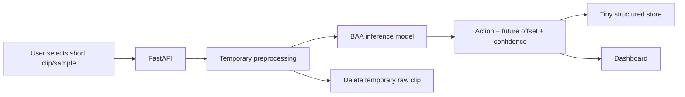

# Deployment Architecture

The deployment is a portfolio/system contribution, not the thesis novelty.

## Constraints
- zero recurring paid infrastructure
- short clips or precomputed demo samples
- raw uploads are temporary
- store structured predictions and experiment metadata, not large media
- model version recorded with each result
