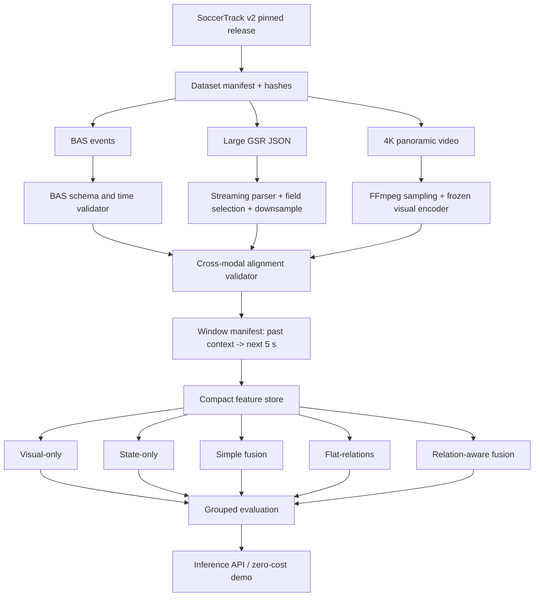

# End-to-End Data and Research System Architecture

## Core design rules
1. Raw 4K and giant JSON files are source material, not epoch-time training inputs.
2. Process one match/half at a time.
3. Save continuous compact arrays and a window index instead of duplicated clips.
4. Use CPU for schema validation, streaming, alignment, statistics, and window construction.
5. Use accelerator primarily for one-time visual feature extraction and lightweight model training.
6. Preserve every exclusion and correction in machine-readable audit files.
