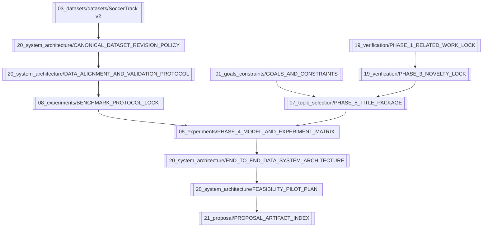

# Knowledge Graph

## Active research spine

## Evidence spine
- [[04_literature/sources/SOURCE - FAANTRA 2025]]
- [[04_literature/sources/SOURCE - SoccerNet Challenges 2026]]
- [[04_literature/sources/SOURCE - Ochin Game State Action Detection 2025]]
- [[04_literature/sources/SOURCE - Beyond Pixels 2025]]
- [[04_literature/sources/SOURCE - FOOTPASS 2025]]
- [[04_literature/sources/SOURCE - SoccerTrack v2 2025]]
- [[15_ai_configuration/research_runs/PR 005 - Claude Final Evidence Lock]]
- [[19_verification/FULL_EVIDENCE_REVERIFICATION_2026-08-14]]

## Dataset and benchmark spine
- [[03_datasets/analysis/SoccerTrack v2 BAS Statistical Audit]]
- [[03_datasets/analysis/SoccerTrack v2 GSR Practical Handling]]
- [[20_system_architecture/CANONICAL_DATASET_REVISION_POLICY]]
- [[20_system_architecture/GSR_STREAMING_AND_COMPRESSION_PIPELINE]]
- [[20_system_architecture/VISUAL_FEATURE_EXTRACTION_PIPELINE]]
- [[20_system_architecture/DATA_ALIGNMENT_AND_VALIDATION_PROTOCOL]]
- [[08_experiments/BENCHMARK_PROTOCOL_LOCK]]

## Experiment and execution spine
- [[08_experiments/PHASE_4_MODEL_AND_EXPERIMENT_MATRIX]]
- [[20_system_architecture/COMPUTE_BUDGET_AND_STOP_RULES]]
- [[20_system_architecture/FEASIBILITY_PILOT_PLAN]]
- [[20_system_architecture/DEPLOYMENT_ARCHITECTURE]]
- [[13_execution/ONE_MONTH_EXECUTION]]

## Historical branches preserved
- [[05_direction/PCBAS_STATE]]
- [[07_topic_selection/candidates/Candidate 02 - Tactical Spatiotemporal Retrieval]]
- [[07_topic_selection/candidates/Candidate 03 - Tactical State Forecasting]]
- [[07_topic_selection/downgraded/PCBAS Generic Tactical Context]]
- [[07_topic_selection/rejections/Generic Football RAG]]

## Version provenance
See [[18_version_history/VERSION_HISTORY]], [[16_session_history/SESSION_LOG]], and [[14_decisions/DECISION_LOG]].

Proposal draft: [[21_proposal/PROPOSAL_DRAFT]].
