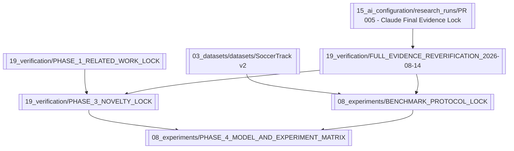

# Knowledge Graph

## Scientific-lock spine

## Key evidence
- [[04_literature/sources/SOURCE - FAANTRA 2025]]
- [[04_literature/sources/SOURCE - SoccerNet Challenges 2026]]
- [[04_literature/sources/SOURCE - Ochin Game State Action Detection 2025]]
- [[04_literature/sources/SOURCE - Beyond Pixels 2025]]
- [[04_literature/sources/SOURCE - FOOTPASS 2025]]
- [[04_literature/sources/SOURCE - SoccerTrack v2 2025]]

## Active candidate
[[07_topic_selection/TOPIC_LOCK_STATUS]] retains Candidate 01 with narrowed novelty. Phase 5 title selection belongs to the next release.

## Historical branches
[[05_direction/PCBAS_STATE]], [[07_topic_selection/candidates/Candidate 02 - Tactical Spatiotemporal Retrieval]], [[07_topic_selection/candidates/Candidate 03 - Tactical State Forecasting]], and all rejection/downgrade nodes remain preserved.

## Provenance
See [[18_version_history/VERSION_HISTORY]], [[16_session_history/SESSION_LOG]], and [[14_decisions/DECISION_LOG]].
