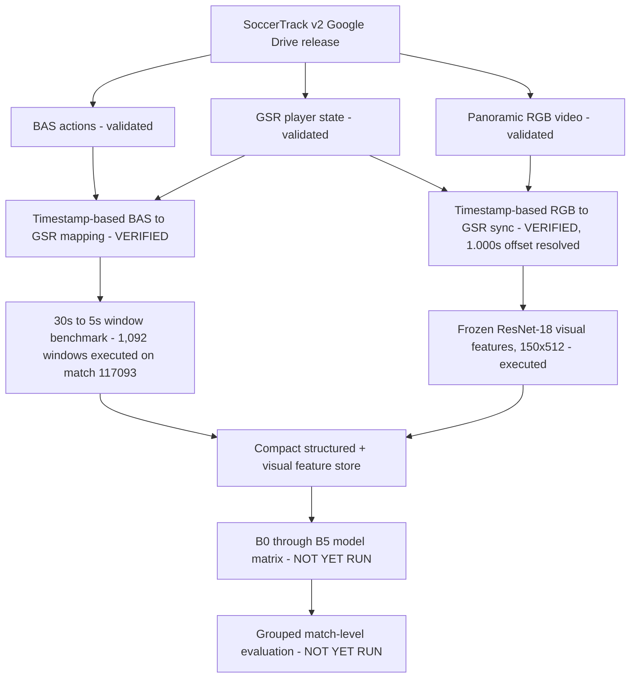

# System Architecture — Release 05 (executed portion highlighted)

Everything above the "NOT YET RUN" boundary has been executed and
verified on one representative match. Nothing below it has started.
