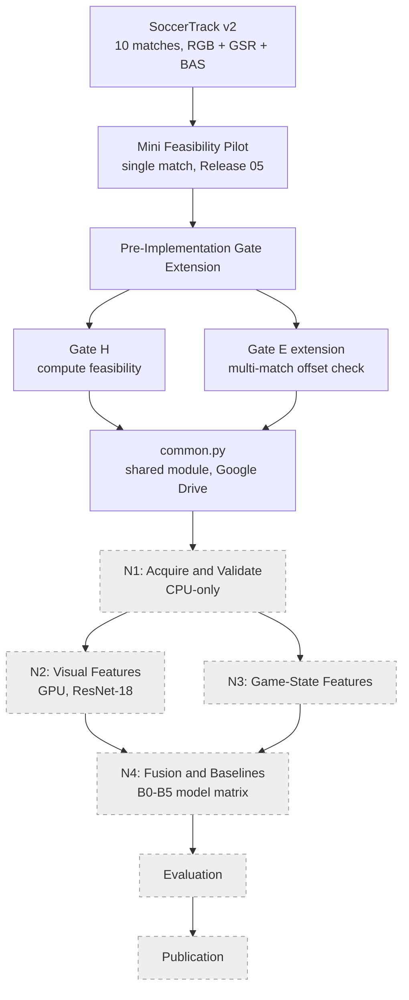

# System Architecture — Release 06

Rendered image: `../images/thesis/thesis_system_architecture_r06.png`
(created 2026-09-22, Release 06, from this file's mermaid source).

## Reading this diagram

Solid boxes (A through F) are complete and documented in this release.
Dashed boxes (G through L) represent the pipeline as designed and
decided, not yet executed within this release's scope — N1 has, per
project memory, actually run, but its results are deliberately excluded
from Release 06 and belong to a future release.
