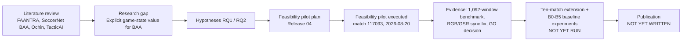

# Research Pipeline — Literature to Feasibility Evidence

```mermaid
flowchart LR
    LIT[Literature review\nFAANTRA, SoccerNet BAA, Ochin, TacticAI] --> GAP[Research gap\nExplicit game-state value for BAA]
    GAP --> HYP[Hypotheses RQ1 / RQ2]
    HYP --> PLAN[Feasibility pilot plan\nRelease 04]
    PLAN --> EXEC[Feasibility pilot executed\nmatch 117093, 2026-08-20]
    EXEC --> EVID[Evidence: 1,092-window benchmark,\nRGB/GSR sync fix, GO decision]
    EVID --> NEXT[Ten-match extension +\nB0-B5 baseline experiments\nNOT YET RUN]
    NEXT --> PUB[Publication\nNOT YET WRITTEN]
```
