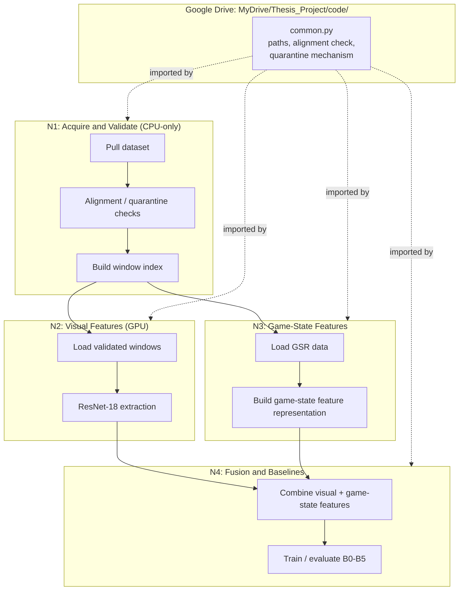

# Four-Notebook Pipeline — Release 06

Rendered image: `../images/thesis/thesis_four_notebook_pipeline_r06.png`
(created 2026-09-22, Release 06, from this file's mermaid source).

## Reading this diagram

`common.py` is imported by all four notebooks rather than duplicated.
N1 is CPU-only per the Gate H result and must complete and checkpoint
before N2's GPU session starts, per the project's existing Colab
workflow convention.
