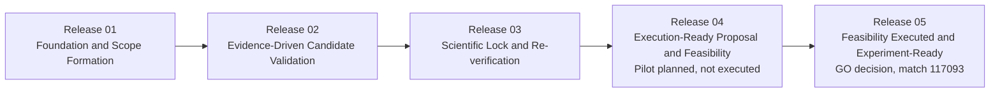

# Release Evolution

```mermaid
flowchart LR
    R1[Release 01\nFoundation and Scope Formation] --> R2[Release 02\nEvidence-Driven Candidate Validation]
    R2 --> R3[Release 03\nScientific Lock and Re-verification]
    R3 --> R4[Release 04\nExecution-Ready Proposal and Feasibility\nPilot planned, not executed]
    R4 --> R5[Release 05\nFeasibility Executed and Experiment-Ready\nGO decision, match 117093]
```
