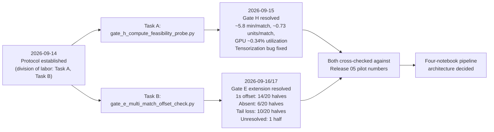

# Gate H / Gate E Resolution Timeline — Release 06

Rendered image: `../images/thesis/thesis_gate_h_gate_e_resolution_r06.png`
(created 2026-09-22, Release 06, from this file's mermaid source).

## Reading this diagram

Task A and Task B ran in parallel per the established division of
labor. Both results were cross-checked against each other and against
the single-match Release 05 pilot before the pipeline architecture
decision was finalized.
